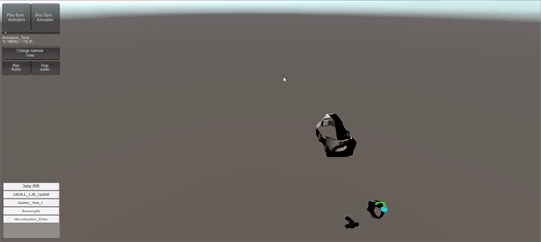

# TiltBrushVisualizer

## Goal  
To study embodied learning by analyzing drawings from Google's Tilt-brush VR application. Allows setting up positional tracking animation for the user with a .tilt file to display the generated strokes during run time.

## Type
Research tool 

## Platform 
PC

## Working state 
Baseline application to show and receive appropriate data is done. Upcoming goal for 2020 is to create a TiltBrush module within Komodo to allow researcher to be able to obtain data remotely. 
    
## Mechanics  
Insert appropriate files to visualize and extrapolate appropriate information through .csv file
    
## Story  
Beginning my graduate studies, I began working with a PhD student doing embodiment research. I was able to figure out how to convert .tilt files into data points that can be visualized in Unity. With this came a method to synchronized movement within Google's Tiltbrush application and the strokes emitted within it to provide appropriate information for the researcher.